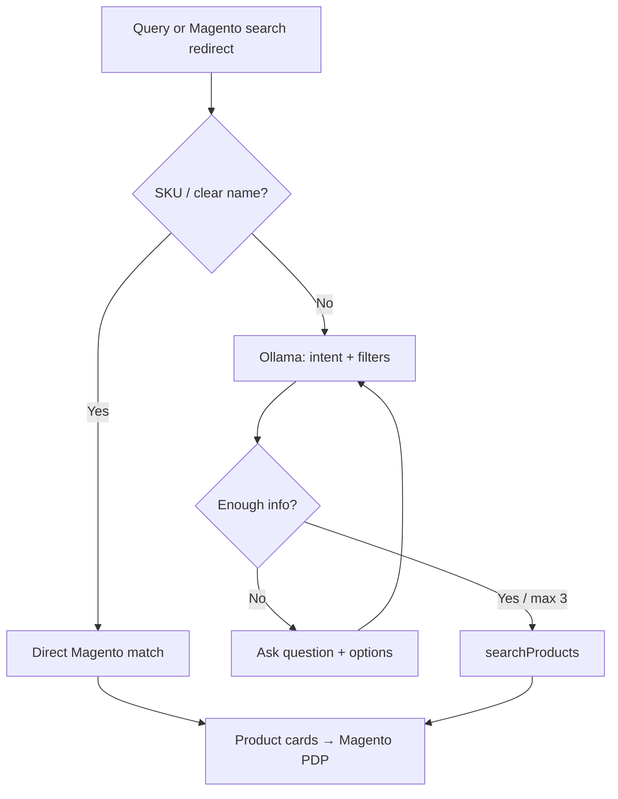
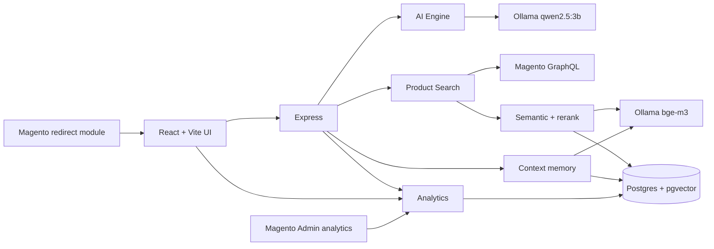
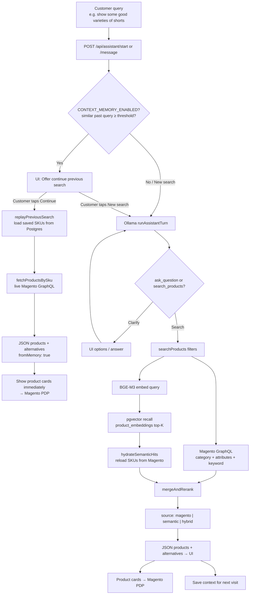
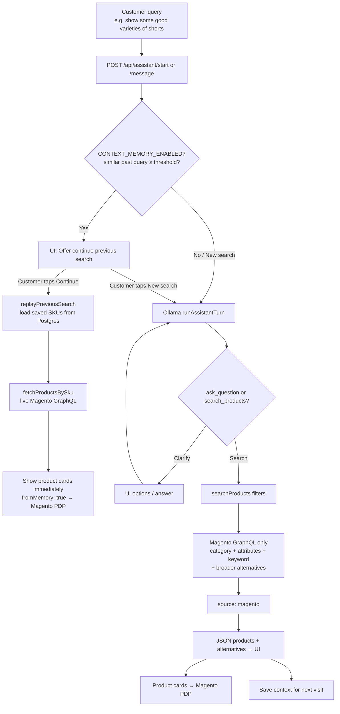

# AI Commerce Assistant – Conversational Product Discovery for Magento

---

# Executive Summary

AI Commerce Assistant turns natural-language shopping into Magento-ready search. Customers describe what they need (“comfortable for the gym,” “motor shaft is grinding”); the assistant clarifies intent, builds filters, and returns **real Magento catalog products**—never invented SKUs, prices, or stock.

**Stack:** Ollama (Qwen chat + BGE-M3 embeddings) → Express AI engine → Magento 2 GraphQL. Optional **hybrid semantic search** (pgvector) and **user context memory** improve recall and returning-shopper reuse. **Search analytics** track zero-result rate, hybrid/semantic lift, and product CTR for marketing ROI—visible in the React dashboard and Magento Admin. A Magento module can redirect storefront search into the assistant UI.

**Who benefits:** shoppers (plain language), sales/support (fewer “find me X” tickets), merchants (better discovery + measurable ROI without replacing Magento).

---

# Problem & Solution

| Pain | Impact |
| ---- | ------ |
| Keyword-only Magento search | Misses intent (“gym clothes” ≠ SKU/category label) |
| Customers don’t know product names | Gifts, accessories, industrial parts suffer most |
| Large catalogs | Relevant items buried; vague queries fail |
| Support dependency | “Help me find…” tickets and abandoned carts |

**B2C:** “Something comfortable for the gym” → weak keyword results.  
**B2B:** “Motor shaft grinding—need replacement” → symptom language ≠ part SKU.

**Root cause:** intent is conversational; Magento search is lexical.

**Solution:** short guided chat (≤3 clarifying questions with option chips) → structured filters + dynamic Magento attributes → live GraphQL results, optionally enriched with semantic recall.

| Capability | Implementation |
| ---------- | -------------- |
| Conversational UI | Chat, chips, product cards |
| NLU | Ollama + LangChain; Zod-validated JSON (`ask_question` / `search_products`) |
| Clarification | Max 3 questions, 2–6 options; domain-aware fallbacks |
| Filtering | Accumulated filters + Magento attribute mapping |
| Retrieval | Magento GraphQL ± hybrid pgvector enrich |
| Fast path | Exact SKU / product name skips Q&A |
| Context (optional) | Postgres memory + previous-search replay |
| Analytics | Zero-result, hybrid lift, CTR; what / how / whom |
| Storefront bridge | Magento module redirect → assistant |

**Shared front of the funnel** (same for both modes):



After filters are ready, retrieval depends on `SEMANTIC_ENABLED` — see the two flowcharts under **Architecture**.

---

# Business Value

Closes the gap between **how customers speak** and **how Magento indexes products**, without replacing the platform.

| Stakeholder | Benefit |
| ----------- | ------- |
| Customers | Plain language → guided options → real in-stock results |
| Sales / support | Fewer find-a-product interruptions |
| Merchants | Better catalog utilization on existing Magento data |
| Marketing / ops | Dashboard: empty searches, hybrid lift, PDP CTR |

**Measurable funnel:** query → clarifications → Magento/hybrid results → PDP click (logged as impressions + clicks).

Why AI: rule trees are brittle per category; an LLM interprets messy language and emits filters while Magento stays authoritative. Embeddings recover paraphrases keywords miss.

---

# AI Capabilities (implemented)

| Capability | Behavior |
| ---------- | -------- |
| **NLU** | Free text → Ollama JSON (clarify or search); Zod + normalization |
| **Domains** | `apparel` / `gear`, `industrial`, `general` (and related heuristics in `engine.ts`) |
| **Questions** | ≤3 turns; 2–6 chips; junk Yes/No rejected; industrial blocked from apparel prompts |
| **Filters** | Shared: query, domain, keywords, budget. Apparel/gear: category, fit, usage, style, color. Industrial: symptom, part family, equipment, part/motor type. Mapped via `magento/attributes.ts` |
| **Hybrid search** | Magento first → BGE-M3 embed → `product_embeddings` recall → merge/re-rank (`semantic/rerank.ts`) → source `magento` \| `semantic` \| `hybrid` |
| **Sessions** | In-memory UUID chat (lost on restart) |
| **Context memory** | Optional: save/search/replay prior queries for `userId` against live Magento stock/price |
| **Analytics** | Every completed search → Postgres; card impressions/clicks → CTR; React `/analytics` + Magento Admin ROI dashboard |
| **Guardrails** | Magento-only catalog truth; no fabricated products; no exposing prompts/embeddings to shoppers |

---

# Architecture



| Layer | Tech |
| ----- | ---- |
| Frontend | React 19, Vite 8, Tailwind 4, React Router (+ `/analytics` dashboard) |
| Backend | Node 20+, Express 5, Zod, LangChain Ollama |
| Catalog | Magento 2 GraphQL (products, categories, attributes) |
| Vectors | PostgreSQL + pgvector; embeddings `bge-m3` (1024-d) |
| Chat LLM | `qwen2.5:3b` via Ollama |
| Session | In-memory Map; optional Postgres context |
| Analytics | Postgres search + product events; Magento Admin `Klizer_AiCommerceAnalytics` |

**Data path:** LLM/heuristics → category + attribute resolution → Magento query → optional semantic merge → UI cards → analytics (search log + impressions/clicks). Embedding sync: `npm run sync:embeddings` (Magento crawl → vectors). Merchant vertical behavior can also be driven by `server/domain-config.json` (see `DOMAIN_CONFIG_PATH`).

### Retrieval flows: `SEMANTIC_ENABLED`

Intent / clarification is the same in both modes. Only the **product retrieval** branch differs.

#### A) `SEMANTIC_ENABLED=true` (hybrid Magento + pgvector)

Requires Postgres + pgvector, `DATABASE_URL`, and a prior embedding sync (`npm run sync:embeddings` or `POST /api/semantic/sync`).



| Hop | What happens |
| --- | ------------ |
| Context match | Optional: embed query; if similarity ≥ threshold, **offer** Continue vs New (does not show products yet). |
| **Continue** | `replayPreviousSearch` → saved SKUs → **live Magento** `fetchProductsBySku` → cards shown right away (`fromMemory: true`). **Skips** Ollama + semantic. |
| **New search** | Same as no-context path below. |
| AI | Intent → filters; ≤3 clarifying questions. |
| Magento | Live GraphQL (name, SKU, price, image, stock, URL). |
| Semantic | BGE-M3 → `product_embeddings` recall → hydrate SKUs from Magento. |
| Hybrid | `mergeAndRerank` → `source`: `magento` \| `semantic` \| `hybrid`. |
| UI | Magento-backed cards only; never LLM-invented products. |
| Persist | Completed **new** search saved for future Continue offers. |

#### B) `SEMANTIC_ENABLED=false` (Magento only)

No pgvector product recall. Chat LLM still runs; Magento GraphQL is the sole catalog search. Postgres is only needed if `CONTEXT_MEMORY_ENABLED=true`.



| Hop | What happens |
| --- | ------------ |
| Context match | Same optional **offer** as above (independent of semantic). |
| **Continue** | Replay saved SKUs → live Magento refresh → show cards (`fromMemory: true`). No Ollama. |
| **New search** | AI → Magento GraphQL only. |
| Semantic | **Skipped** — no embed, no `product_embeddings` recall, no hybrid re-rank. |
| UI | Cards from Magento results; `source` stays `magento` (or memory replay). |

| Flag | Product search | Needs embedding sync? |
| ---- | -------------- | --------------------- |
| `SEMANTIC_ENABLED=true` | Magento + pgvector hybrid | **Yes** |
| `SEMANTIC_ENABLED=false` | Magento only | No |

---

# Analytics (ROI) — implemented

Marketing needs proof that AI search helps: empty searches, how often semantic/hybrid improves over Magento keywords alone, and whether shown products get clicked.

### What / how / whom

| Question | Data |
| -------- | ---- |
| **What** did they search? | `original_query` on each completed search |
| **How** was it resolved? | `source` (`magento` \| `semantic` \| `hybrid`), `match_type`, filters JSON |
| **Whom** searched? | `user_id` (stable guest UUID in browser today; Magento customer id is roadmap) |

### Metrics

| Metric | Definition |
| ------ | ---------- |
| **Zero-result rate** | Searches with no primary and no alternative products |
| **Hybrid / semantic share** | Share of searches whose `source` is `hybrid` or `semantic` (lift vs Magento-only path) |
| **CTR** | Product card **clicks** ÷ **impressions** |

### Pipeline

```text
Assistant search completes
  → INSERT ai_search_analytics (query, user, source, match_type, counts)
UI shows product cards
  → POST /api/analytics/track  impression(s)
Shopper clicks View Product
  → POST /api/analytics/track  click
Dashboard / Magento Admin
  → GET /api/analytics/summary  +  /searches
```

Requires `DATABASE_URL` and migration `003_search_analytics.sql` (`npm run db:migrate:analytics` or full `db:migrate`). Independent of `CONTEXT_MEMORY_ENABLED`, but shares the same Postgres.

### Surfaces

| Surface | URL / path |
| ------- | ---------- |
| React dashboard | `http://localhost:5173/analytics` (header → **Analytics**) |
| APIs | `GET /api/analytics/summary`, `/searches`, `POST /track`, `/status` |
| Magento Admin | Module `Klizer_AiCommerceAnalytics` → **AI Commerce Analytics → Search ROI Dashboard** |

Install Magento module from `magento/Klizer/AiCommerceAnalytics` (copy to `app/code/Klizer/AiCommerceAnalytics`, enable, configure API base URL `http://127.0.0.1:3001`).

### Demo talking points

1. Run 2–3 assistant searches; open a product (CTR).  
2. Open `/analytics` — show zero-result %, hybrid share, CTR, top queries, recent rows (what / how / whom).  
3. Optionally open Magento Admin ROI dashboard (same API).  
4. Contrast Semantic OFF (`source: magento`) vs ON (`hybrid` / `semantic` rows appear).

---

# Integrations & APIs

| Integration | Detail |
| ----------- | ------ |
| Magento GraphQL | Products, categories, filterable attributes |
| Assistant API | `POST /api/assistant/start`, `/message`, `/search` |
| Semantic API | `GET /api/semantic/status`, `POST /sync`, `POST /search` |
| Context API | `GET /api/context/status`, `POST /save`, `GET /latest` |
| Analytics API | `GET /api/analytics/summary`, `/searches`, `POST /track` |
| Health | `GET /api/health` (model, Magento, semantic, context, analytics) |
| Storefront | `Klizer_AiCommerceAssistant` redirects search to assistant URL |
| Magento Admin | `Klizer_AiCommerceAnalytics` — Search ROI dashboard |

Landing URL (dev): `http://localhost:5173/ai-assistant?q=Your+Query`  
Analytics UI: `http://localhost:5173/analytics`  
Admin (search redirect): **Stores → Configuration → Klizer → AI Commerce Assistant**.  
Admin (ROI): **AI Commerce Analytics → Search ROI Dashboard**.

---

# Deployment (dev)

| Component | Setup |
| --------- | ----- |
| UI | Vite `:5173` (proxies `/api` → `:3001`) |
| API | Express `:3001` |
| Ollama | `qwen2.5:3b` + `bge-m3` |
| Magento | GraphQL endpoint |
| Postgres | `DATABASE_URL` + pgvector (semantic / context / **analytics**) |

| Env flag | Role |
| -------- | ---- |
| `SEMANTIC_ENABLED` | Hybrid Magento + pgvector |
| `CONTEXT_MEMORY_ENABLED` | Save/reuse search context |
| `DATABASE_URL` | Shared Postgres (also powers analytics) |
| `EMBEDDING_MODEL` / `DIMS` | Default `bge-m3` / `1024` |
| `SEMANTIC_TOP_K` / scores | Recall depth & thresholds |

```bash
cd server && npm i && npm run db:migrate && npm run sync:embeddings && npm run dev
# other terminal
npm i && npm run dev
```

UI: `http://localhost:5173/ai-assistant` · Analytics: `http://localhost:5173/analytics` · Health: `http://localhost:3001/api/health`

**Production notes:** PM2/containers, Nginx/TLS, managed Postgres, Redis for multi-instance sessions, rate limits, protect Magento tokens.

---

# Demo Walkthrough

| Demo | Flow |
| ---- | ---- |
| **A – Apparel / gym** | “Comfortable for the gym” → product type / usage / color-budget → Magento (± semantic) cards → PDP |
| **B – Industrial** | “Motor shaft grinding—need replacement” → part type → motor type → real Magento parts |
| **C – Direct SKU** | Paste SKU/name → skip Q&A → match + alternatives |
| **D – Context replay** | Save search for `userId` → similar query → continue previous filters on live catalog |
| **E – Semantic enrich** | Sync embeddings → vague query → `hybrid` / `semantic` results when keywords are weak |
| **F – Shorts (semantic + context)** | “Show some good varieties of shorts” → see **Architecture → SEMANTIC_ENABLED=true** flowchart: context check → AI filters → Magento + pgvector → hybrid cards → save context |
| **G – Analytics ROI** | After a few searches + PDP clicks → `/analytics` (or Magento Admin) → zero-result %, hybrid share, CTR, what/how/whom table |

*(Entry: open the assistant UI, or Magento search redirect into the same UI.)*

**Demo F talking points**

1. Turn on `SEMANTIC_ENABLED` + `CONTEXT_MEMORY_ENABLED`; confirm `/api/health` shows both green.  
2. Ensure embeddings are synced.  
3. Ask: *show some good varieties of shorts*.  
4. Show response `source` (`magento` / `semantic` / `hybrid`) and card reasons (e.g. “Semantic match ~78%”).  
5. Repeat a similar query with the same `userId` to demo context reuse / continue previous search.

**Demo G talking points**

1. Confirm `/api/health` → `analytics.enabled: true` (and `db:migrate:analytics` applied).  
2. Complete a search; click **View Product** on a card.  
3. Open **Analytics** — call out zero-result rate, hybrid/semantic share, CTR.  
4. Scroll **Recent searches**: query (what), source/match (how), user id (whom).  
5. Optional: Magento **AI Commerce Analytics → Search ROI Dashboard**.

---

# Source Layout (simplified)

```text
AI-Commerce-Assistant/
├── src/                     # React assistant UI + /analytics page
├── magento/
│   └── Klizer/AiCommerceAnalytics/   # Magento Admin ROI dashboard
└── server/src/
    ├── ai/                  # engine.ts, prompt.ts
    ├── analytics/           # search logs, impressions, CTR summary
    ├── routes/              # assistant, context, semantic, analytics
    ├── services/            # productSearch, contextReplay
    ├── semantic/            # sync, repository, rerank
    ├── context/             # embeddings, memory, preferences
    ├── magento/             # GraphQL, attributes, categories
    ├── scripts/             # migrate, syncEmbeddings
    └── session/             # in-memory store
```

External: Magento modules `Klizer_AiCommerceAssistant` (search redirect), `Klizer_AiCommerceAnalytics` (Admin ROI).

---

# Innovation

| Usual approach | Limitation | This project |
| -------------- | ---------- | ------------ |
| Magento keywords | Fails on intent/symptom language | Clarify → structured Magento query |
| Keywords after AI filters | Still misses paraphrases | Optional hybrid semantic recall |
| Generic chatbots | Weak catalog grounding | Ask or search only; products from Magento |
| Generative shopping | Hallucinated SKUs/prices | Magento as sole catalog authority |
| Stateless assistants | Re-ask every visit | Optional context replay |
| Disconnected AI widget | Separate from store search | Magento search redirects into assistant |
| No search ROI visibility | Can’t prove lift or CTR | Analytics: zero-result, hybrid share, clicks |

**Closed loop:** understand → clarify → filter → real catalog (lexical ± semantic) → PDP → **measurable** impressions/clicks.

---

# Roadmap (next)

- Facet-aware clarification options from Magento aggregations  
- RAG over manuals/specs (industrial)  
- Persistent chat sessions (Redis) + add-to-cart / quote in chat  
- Authenticated Magento shopper context (named “whom” in analytics); B2B company accounts  
- A/B vs classic Magento keyword search (controlled experiment on top of current analytics)  
- Voice / image for warehouse & parts ID; agentic cart/reorder under guardrails  
- Production hardening (containers, multi-store, CRM/ERP handoff)

---

# Conclusion

A Magento-native path from **ambiguous intent** to **authoritative catalog results**: open-source LLM, strict schemas, domain heuristics, GraphQL, optional BGE-M3/pgvector hybrid search, context memory, and **search analytics** (zero-result, hybrid lift, CTR)—with storefront and Admin bridges. Demo value is inspectable: run the UI, ask a real Magento-backed question, click through to a PDP, and show marketing the ROI dashboard.
