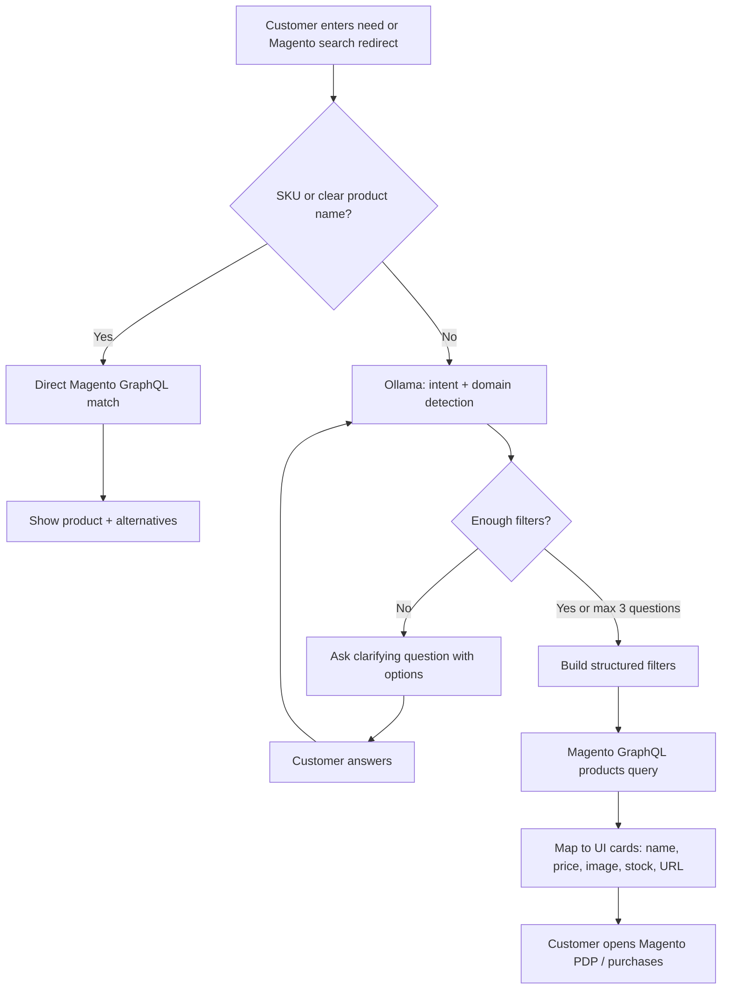
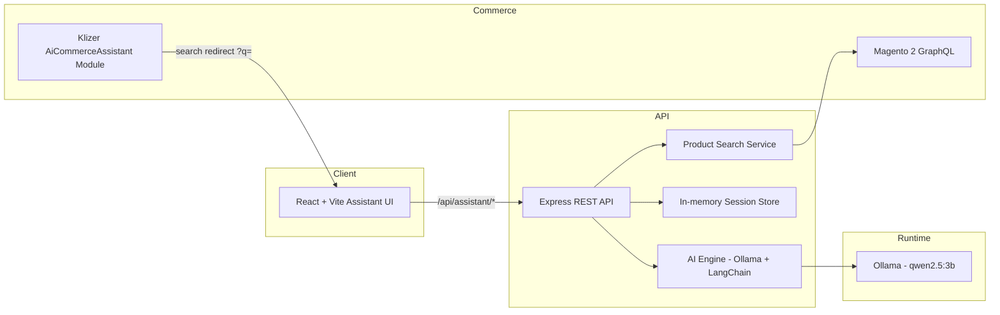
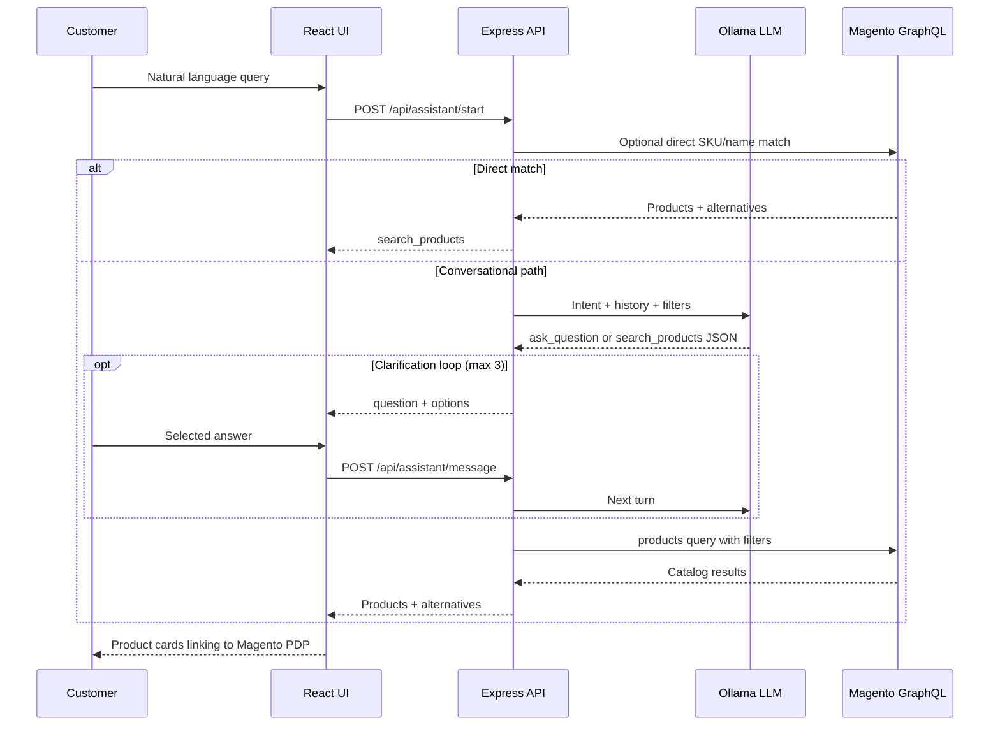
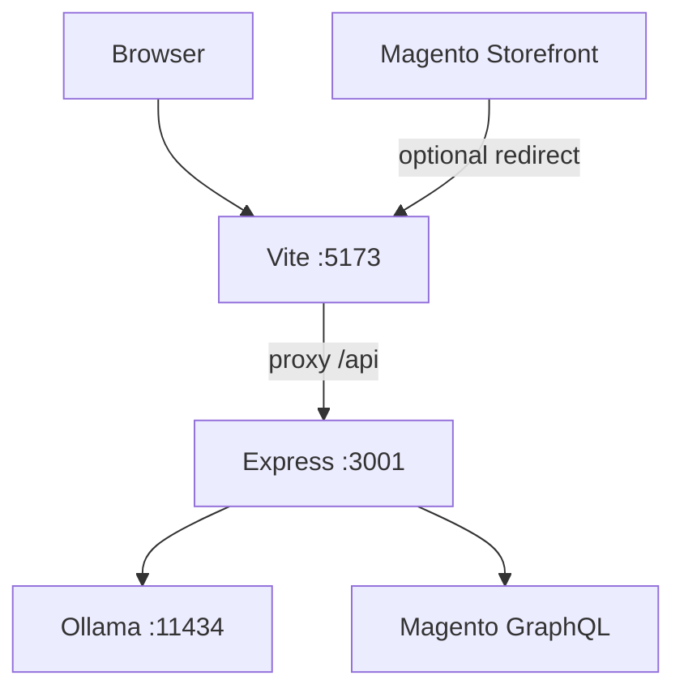

# AI Commerce Assistant – Conversational Product Discovery for Magento B2B & B2C Commerce

---

# Executive Summary

AI Commerce Assistant is a conversational product-discovery layer for Magento 2 that replaces keyword-only search with a guided, natural-language shopping experience. Customers describe what they need in plain language—whether a gift for a spouse, comfortable gym apparel, or an industrial replacement part—and the assistant clarifies intent, builds structured filters, and returns **real products from the Magento catalog**.

The application was built to solve a persistent commerce problem: shoppers often know the outcome they want (“something comfortable for the gym,” “my motor shaft is grinding”) but not the exact SKU, category path, or attribute names Magento search expects. Traditional search fails these journeys, driving support tickets, abandoned carts, and lost revenue—especially in large B2B catalogues and mixed B2B/B2C assortments.

Who benefits:

- **Shoppers** find products faster without knowing catalog jargon  
- **Sales and support** spend less time translating vague requests into SKUs  
- **Merchants** improve discovery and conversion without replacing Magento  

AI transforms the experience by interpreting intent with an open-source LLM (Ollama + Qwen), asking focused clarifying questions with selectable options, then querying Magento 2 GraphQL with the resulting filters. The model never invents products, prices, or stock—Magento remains the system of record.

The innovation is not a generic chatbot. It is a **commerce-native assistant** wired into Magento search and the storefront: a Magento module can redirect native search into the assistant, preserving catalog truth while upgrading discovery from keywords to conversation. Semantic vector search (PostgreSQL + pgvector) is on the roadmap (Phase 4); Phase 3 delivers live conversational discovery against Magento today.

---

# Problem Statement

## Current eCommerce search problems

Modern Magento storefronts still rely heavily on **keyword-based search**. That model assumes customers know product names, brand spellings, attribute codes, or category labels. In practice they often do not.

| Pain point | Impact |
| ---------- | ------ |
| Keyword-only search | Misses intent (“comfortable for gym” ≠ exact product name) |
| Customers don’t know product names | Especially true for gifts, accessories, and industrial parts |
| Large product catalogues | Relevant items buried; poor ranking for vague queries |
| Poor product discovery | Browse fatigue; wrong category dead-ends |
| Low conversion rates | Friction between intent and purchase |
| High support dependency | “Can you help me find…?” tickets and chat handoffs |
| Time-consuming selection | Multi-step filter panels without guidance |
| Purchase abandonment | Shoppers leave when search returns noise or nothing |

## B2C scenario

A shopper wants a **gift for their husband** or **something comfortable for the gym**. They open Magento search and type natural language. Keyword search returns weak or empty results because the catalogue is organized by category and attributes, not by occasion, recipient, or lifestyle intent. The shopper either browses endlessly, messages support, or abandons.

## B2B / industrial scenario

A maintenance buyer says: **“My motor shaft is making a grinding noise. I need the right replacement component.”** They know the symptom and equipment context, not the SKU. Keyword search on “grinding” or “motor” may return irrelevant SKUs or miss the correct part family. Sales engineers become the search engine—slow, costly, and hard to scale.

Both scenarios share the same root cause: **intent is conversational; Magento search is lexical**. Bridging that gap is the problem this project addresses.

---

# Solution Overview

AI Commerce Assistant converts natural-language intent into Magento-ready search criteria through a short, structured conversation.

## How it solves the problem

| Capability | How it works in this project |
| ---------- | ---------------------------- |
| Conversational shopping | Chat UI with messages, option chips, and product cards |
| Natural language search | Customer query → Ollama LLM interprets need |
| AI clarification questions | Up to 3 follow-ups with 2–6 selectable options |
| Smart filtering | Accumulated filters (category, usage, price, domain hints, etc.) |
| Product recommendations | Live Magento GraphQL `products` results + related alternatives |
| Magento integration | GraphQL catalog + optional storefront search redirect module |
| Context-aware experience | In-memory session with message history and rolling filters |
| Direct match fast path | Exact SKU / clear product name skips Q&A and returns Magento hits |

**Not claimed in Phase 3:** vector embeddings, pgvector semantic search, or a separate recommendation ML model. Ranking and relevance come from Magento search plus domain heuristics and filter construction.

## End-to-end customer journey



---

# Business Value

## What business problem does this solve?

It closes the gap between **how customers describe needs** and **how Magento indexes products**, reducing failed searches, support load, and abandoned discovery—without replacing the commerce platform.

## Who benefits?

| Stakeholder | Benefit |
| ----------- | ------- |
| **Customers** | Describe needs in plain language; guided options; real in-stock results |
| **Sales teams** | Fewer “find me a part/gift” interruptions; clearer intent capture |
| **Customer support** | Deflect repetitive “help me find…” tickets into self-serve conversation |
| **Store owners** | Better catalog utilization and discovery on existing Magento data |
| **Marketing teams** | Intent-rich journeys (gift, gym, industrial) usable for merchandising narratives |
| **Business stakeholders** | Higher conversion potential and measurable assistant sessions without rip-and-replace |

## Time savings

| Area | Realistic improvement |
| ---- | --------------------- |
| Product discovery | Minutes of filter hunting → a few guided answers |
| Support | Common find-a-product chats handled by the assistant |
| Sales efficiency | Intent and filters captured before human handoff (future CRM hook) |

## Cost savings

- Lower volume of search-related support contacts  
- Fewer wrong-product purchases when clarification precedes selection  
- Better conversion on vague but high-intent queries  
- Potential uplift in average order value when alternatives are shown alongside matches  

*(Exact ROI depends on catalog size, traffic, and adoption; Phase 3 establishes the measurable funnel: query → clarifications → Magento results → PDP click.)*

## Why AI is the right solution

Traditional Magento search is strong when the query matches indexed text. It is weak when the query is **goal-, symptom-, or occasion-based**. Rule-based chatbots require brittle decision trees per category. An LLM can interpret messy language, choose the next clarifying question, and emit structured filters—while Magento remains authoritative for products, price, and stock.

---

# AI Capabilities

Only capabilities implemented in the current codebase are listed below.

## Natural Language Understanding

Customer free text is sent to Ollama (`ChatOllama` / LangChain). The system prompt requires JSON responses for either clarification or search—not free-form product invention.

## Intent / Domain Detection

Queries are classified into domains used to steer questions and filters:

| Domain | Example |
| ------ | ------- |
| `gift` | Gift for husband |
| `apparel` / `gear` | Comfortable for the gym |
| `industrial` | Motor shaft grinding / replacement part |
| `general` | Fallback |

## Conversational Question Generation

- Maximum **3** clarifying questions per session  
- Each question includes **2–6** options for fast tap/click answers  
- Domain-aware fallbacks if the model response fails validation  
- Heuristics reject junk Yes/No options and block apparel-style questions on industrial flows  

## Structured Filter Extraction

Hints and LLM output accumulate filters such as:

- Shared: `query`, `domain`, budget (`price_min` / `price_max`)  
- Gift: `occasion`, `gender`, `recipient`, `category`  
- Apparel/gear: `category`, `fit`, `usage`, `style`, `color`  
- Industrial: `symptom`, `part_family`, `equipment`, `part_type`, `motor_type`  

## Magento-Backed Recommendations

When ready (or after three clarifications), filters drive a Magento GraphQL products search. The UI shows primary matches and alternatives. “Why recommended” style reasons are derived from mapping/heuristics—not a separate ML recommender.

## Session Memory

In-memory session store (UUID, messages, filters, status). Recent conversation turns are included in the LLM prompt. Sessions do not persist across server restarts.

## Direct Match Path

If the query looks like a SKU or exact product name, Magento is queried immediately and clarifying questions are skipped.

## Guardrails

- Magento is the **only** product source  
- Zod schemas validate AI JSON (`ask_question` / `search_products`)  
- Prompt forbids fabricating catalog data or exposing implementation details to the shopper  

### Not in Phase 3

Vector search, embeddings (e.g. BGE-M3), pgvector, persistent confidence scoring as a product feature, and cross-session customer memory.

---

# Architecture Overview

## Logical architecture



## Layers (as implemented)

### Frontend

- React 19 + TypeScript  
- Vite 8 + Tailwind CSS 4  
- React Router  
- Assistant components + lightweight UI primitives (CVA / shadcn-style patterns)  

### Backend

- Node.js + Express 5  
- REST endpoints under `/api/assistant`  
- Zod request/response validation  
- LangChain Ollama client  

### Data / catalog

- Magento 2 GraphQL (products + category list)  
- No application PostgreSQL in Phase 3  

### AI layer

- Ollama local/runtime LLM  
- Default model: `qwen2.5:3b`  
- Prompt + heuristic engine in `server/src/ai/`  

### Magento integration layer

- GraphQL client, product search, mapper, category tree/match  
- Optional Magento module redirects storefront search to the assistant  

### Session layer

- In-process `Map` session store  

### Logging / analytics

- Health check and operational console usage; no dedicated analytics warehouse in Phase 3  

## Data flow: query → recommendation



---

# AI Models Used

| Model / Technology | Purpose | Why chosen |
| ------------------ | ------- | ---------- |
| **Ollama** | Local/runtime host for open-source LLMs | Fast iteration, no cloud API key dependency for demos, controllable latency |
| **Qwen2.5 3B** (`qwen2.5:3b`) | Intent understanding, clarification JSON, filter extraction | Small enough for hackathon/demo hardware; strong instruction following for structured JSON |
| **LangChain (`@langchain/ollama`)** | Chat wrapper around Ollama | Clean message plumbing; swappable model via env |
| **Zod** | Validate/normalize AI JSON | Prevents malformed actions from reaching Magento or the UI |
| **Magento GraphQL search** | Product retrieval | System of record for name, SKU, price, image, stock, URL |

**Roadmap (not used yet):** PostgreSQL, pgvector, embedding models (e.g. BGE-M3) for semantic catalog search.

---

# Data Sources

## Current

| Source | Use |
| ------ | --- |
| Magento products | Name, SKU, price, image, stock, URL via GraphQL |
| Magento categories | Category tree for matching / gift category options |
| Product attributes (via filters) | Price range, category_id, keyword search, SKU equality |
| Session conversation | Short-term filter and message context |

## How data becomes AI-usable knowledge

1. Customer language is interpreted by the LLM into structured criteria.  
2. Heuristics enrich filters from free text (budget phrases, industrial symptoms, gift recipient, etc.).  
3. Category matching maps human labels to Magento `category_id` where possible.  
4. Magento executes the catalog query; results are mapped to UI product cards.  

The AI does **not** hold a separate product knowledge base in Phase 3—the live Magento database is the knowledge base.

## Future data sources

- Customer search history  
- Purchase history / Customer 360  
- Indexed embeddings of product text for semantic recall  

---

# Integrations

## Implemented

| Integration | Detail |
| ----------- | ------ |
| **Magento 2 GraphQL** | `products` query + `categoryList`; store code and optional auth token |
| **Assistant REST API** | `POST /start`, `/message`, `/search`; `GET /api/health` |
| **Magento search redirect module** | `Klizer_AiCommerceAssistant` — plugin on search result URL; admin-configurable assistant URL |
| **Ollama HTTP API** | Default `http://127.0.0.1:11434` |

## Magento storefront bridge

1. Module rewrites `Magento\Search\Helper\Data::getResultUrl()` toward the assistant.  
2. Optionally redirects `/catalogsearch/result/?q=...` into the AI UI.  
3. Admin: **Stores → Configuration → Klizer → AI Commerce Assistant**.  

Typical landing URL:

`http://localhost:5173/ai-assistant?q=Your+Query`

## Future integrations

- ERP (availability beyond Magento stock)  
- CRM (handoff with captured intent/filters)  
- PIM (richer attribute semantics for clarification)  
- Magento REST (not required today; GraphQL covers the demo path)  

---

# Deployment Architecture

## Development (current)

| Component | Typical setup |
| --------- | ------------- |
| Frontend | Vite dev server (`localhost:5173`), `/api` proxied to `3001` |
| Backend | `tsx watch` Express API on port `3001` |
| Ollama | Local process with `qwen2.5:3b` |
| Magento | Local/remote Magento 2 GraphQL endpoint (e.g. `http://m248p4.local/graphql`) |



## Production considerations (guidance)

Phase 3 is demo/dev oriented. A production hardening path would typically include:

| Concern | Approach |
| ------- | -------- |
| Process management | Node process manager (e.g. PM2) or container orchestration |
| Reverse proxy | Nginx/TLS termination in front of UI + API |
| Magento | Existing Magento hosting; GraphQL over HTTPS |
| Ollama | Dedicated GPU/CPU host or managed LLM endpoint |
| Sessions | Replace in-memory Map with Redis/DB |
| Scalability | Stateless API replicas + shared session store; Magento and Ollama scaled independently |
| Security | Restrict CORS, protect Magento tokens, rate-limit assistant endpoints |
| Monitoring | Health endpoint already exposes model + Magento reachability; add APM/logs as needed |

Docker is optional and not required for the current prototype.

---

# Future Scalability

How the platform can evolve beyond Phase 3:

| Direction | Value |
| --------- | ----- |
| **Semantic search (Phase 4)** | PostgreSQL + pgvector for meaning-based recall when keywords fail |
| **RAG over catalog copy** | Ground answers in product descriptions/specs |
| **Voice commerce** | Speech-to-text into the same assistant pipeline |
| **Image search** | Visual similarity into Magento SKUs |
| **Multilingual shopping** | Locale-aware prompts + Magento store views |
| **Customer 360** | Personalize from history and segments |
| **Stronger recommendations** | Cross-sell/upsell beyond current alternatives |
| **Order tracking** | Conversational post-purchase status |
| **Inventory prediction** | Assist B2B replenishment decisions |
| **Sales analytics** | Funnel metrics on clarifications → PDP |
| **Supplier integration** | Expand industrial part coverage |
| **Mobile app / PWA** | Same API, native shell |
| **Multi-store support** | Store-code aware assistant configs |
| **Agentic commerce** | Multi-step tools (cart, quote, reorder) under guardrails |

---

# Prototype Walkthrough

## Demo A – Gift discovery (B2C)

1. Customer opens `/ai-assistant` or arrives from Magento search with `?q=`.  
2. Types or selects: **“I'm looking for a gift for my husband.”**  
3. Domain resolves to `gift`; gender/recipient hints captured.  
4. AI asks gift type (options from Magento categories when available, e.g. Watches / Bags / Jackets / Hoodies).  
5. Optional follow-ups: color, budget (within the 3-question cap).  
6. Filters → Magento GraphQL → product cards with price, image, stock, PDP link.  
7. Customer opens Magento product page to purchase.

## Demo B – Industrial replacement (B2B)

1. Customer: **“My motor shaft is making a grinding noise. I need the right replacement component.”**  
2. Domain: `industrial`; symptom/equipment hints extracted.  
3. AI asks component type (e.g. Shaft / Bearing / Motor / Coupling), then motor type as needed.  
4. Structured filters drive Magento keyword + category search.  
5. Real Magento parts returned—not LLM-hallucinated SKUs.

## Demo C – Apparel / gear

1. Customer: **“I need something comfortable for the gym.”**  
2. Clarifications: product type → usage (Training/Running/…) → optional color/budget.  
3. Magento category + price filters → recommendations.

## Demo D – Direct SKU / name

1. Customer pastes a known SKU or exact product name.  
2. Assistant skips Q&A, returns Magento match plus related alternatives.

---

# Technical Stack

| Layer | Technology |
| ----- | ---------- |
| Frontend | React 19, TypeScript, Vite 8, React Router 7 |
| Styling / UI | Tailwind CSS 4, CVA, lucide-react, shadcn-style primitives |
| Backend | Node.js 20+, Express 5, CORS, dotenv, uuid |
| Validation | Zod |
| AI orchestration | LangChain + `@langchain/ollama` |
| LLM runtime | Ollama |
| Embedding model | *Not in Phase 3* (Phase 4) |
| Search | Magento 2 GraphQL `products` + category matching |
| Session | In-memory Map |
| Authentication | Magento GraphQL optional access token; no end-user auth in assistant |
| Hosting (dev) | Local Vite + Express + Ollama + Magento |
| Deployment | Dev-first; PM2/Nginx/containers as production options |
| Testing | Manual/API health + interactive demo (no formal test suite claimed) |
| API documentation | README endpoints + this document |

---

# Source Code Structure

Actual repository layout (simplified):

```text
AI-Commerce-Assistant/
├── README.md
├── HACKATHON_DOCUMENTATION.md
├── project-documentation.md
├── package.json                 # Frontend app
├── vite.config.ts               # Dev server + /api proxy
├── index.html
├── public/
└── src/
    ├── main.tsx
    ├── App.tsx
    ├── index.css
    ├── api/
    │   └── assistant.ts         # Client → Express
    ├── pages/
    │   └── AiAssistantPage.tsx
    ├── hooks/
    │   └── useAssistant.ts
    ├── types/
    │   └── assistant.ts
    ├── components/
    │   ├── assistant/           # Chat, questions, products
    │   └── ui/                  # Button, card, badge, avatar
    ├── lib/
    │   └── utils.ts
    ├── assets/
    └── data/                    # Reserved (empty)
└── server/
    ├── package.json
    ├── .env.example
    └── src/
        ├── index.ts             # Express entry + health
        ├── config/
        │   └── env.ts
        ├── routes/
        │   └── assistant.ts     # /start, /message, /search
        ├── ai/
        │   ├── engine.ts        # Domains, turns, validation
        │   └── prompt.ts        # System prompt contract
        ├── services/
        │   └── productSearch.ts
        ├── magento/
        │   ├── client.ts
        │   ├── search.ts
        │   ├── mapper.ts
        │   ├── types.ts
        │   ├── categoryTree.ts
        │   └── categoryMatch.ts
        └── session/
            └── store.ts
```

**External to this repo:** Magento module `Klizer_AiCommerceAssistant` on the Magento host (search redirect / admin config).

---

# Innovation

## What makes this project unique

| Approach | Limitation | This solution |
| -------- | ---------- | ------------- |
| Traditional Magento keyword search | Fails on intent/occasion/symptom language | Conversational clarification → structured Magento query |
| Generic website chatbots | FAQ scripts; weak catalog grounding | Actions constrained to ask or search; products only from Magento |
| Rule-only guided selling | Brittle trees per category | LLM adapts questions; heuristics enforce domain safety |
| Unconstrained generative shopping | Hallucinated products/prices | Hard guardrail: Magento is sole catalog authority |
| Bolt-on AI widget only | Disconnected from storefront search | Magento module redirects native search into the assistant |

The intelligence is in the **closed loop**: understand → clarify → filter → **real** catalog → PDP. That is significantly more commerce-safe than an open-ended chatbot and more intent-capable than keyword search alone.

---

# Future Enhancements

1. **PostgreSQL + pgvector semantic search (Phase 4)** – Retrieve by meaning when keywords miss.  
2. **Product embedding pipeline** – Index Magento name/description/attributes on sync.  
3. **Hybrid search** – Blend lexical Magento search with vector recall.  
4. **Persistent sessions** – Redis/DB so conversations survive restarts and scale horizontally.  
5. **Authenticated shopper context** – Magento customer token; personalized results.  
6. **Add to cart / quote from chat** – Complete the purchase loop inside the assistant.  
7. **B2B company accounts** – Tier pricing and catalog restrictions in GraphQL context.  
8. **Facet-aware clarifications** – Generate options from live Magento aggregations.  
9. **Confidence & escalation** – Route low-confidence industrial queries to human sales.  
10. **Analytics dashboard** – Track question paths, zero-result rate, PDP CTR.  
11. **A/B test vs keyword search** – Measure conversion lift scientifically.  
12. **Multilingual prompts + store views** – Match Magento locales.  
13. **Voice input** – Hands-free warehouse/B2B ordering scenarios.  
14. **Image upload for parts** – Visual ID for industrial components.  
15. **RAG over manuals/specs** – Cite compatibility before recommending a SKU.  
16. **Order status & returns** – Post-purchase conversational service.  
17. **Merchandising rules** – Boost/bury brands within AI-driven results.  
18. **Multi-store / multi-website configs** – Per-store assistant URLs and models.  
19. **Hardened production deploy** – Containers, Nginx, secrets management, rate limits.  
20. **CRM/ERP hooks** – Push captured intent to Salesforce/ERP for quote follow-up.  
21. **Offline evaluation set** – Golden queries per domain for regression on model upgrades.  
22. **Larger/specialized models** – Swap `OLLAMA_MODEL` for higher-accuracy industrial NLU.  
23. **Agentic tool use** – Guardrailed tools for inventory check, comparable SKUs, reorder.  
24. **Mobile-native experience** – PWA or app shell on the same APIs.  

---

# Conclusion

AI Commerce Assistant demonstrates a practical, Magento-native path from **ambiguous human intent** to **authoritative catalog results**. Business impact comes from faster discovery, support deflection, and safer recommendations grounded in live commerce data. Technical innovation lies in combining an open-source LLM with strict action schemas, domain heuristics, and Magento GraphQL—plus a storefront search bridge so AI discovery meets shoppers where they already search.

Current AI capabilities—natural language understanding, domain detection, clarifying questions, filter accumulation, session context, and Magento-backed product cards—are sufficient for a compelling B2B and B2C hackathon prototype. The roadmap to semantic search, RAG, personalization, and agentic checkout shows a clear path from demo to enterprise value.

Expected ROI follows a simple chain: fewer failed searches → more PDP visits from high-intent conversations → higher conversion and lower assisted-selling cost. For hackathon judges, the value is concrete and inspectable: run the UI, ask a real Magento-backed question, and see **conversation become commerce without inventing the catalog**.

---

## Appendix A – API quick reference

| Method | Path | Purpose |
| ------ | ---- | ------- |
| `GET` | `/api/health` | API, Ollama model, Magento GraphQL status |
| `POST` | `/api/assistant/start` | Start session with `query` |
| `POST` | `/api/assistant/message` | Continue with `sessionId` + `answer` |
| `POST` | `/api/assistant/search` | Direct filter → Magento search |

## Appendix B – Local run

```bash
# Terminal 1 – API
cd server && npm install && npm run dev

# Terminal 2 – UI
npm install && npm run dev
```

Open: `http://localhost:5173/ai-assistant`  
Health: `http://localhost:3001/api/health`

Prerequisites: Node.js 20+, Ollama with `qwen2.5:3b`, reachable Magento 2 GraphQL.
